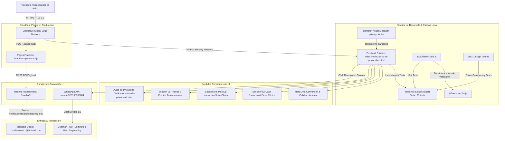

# Arquitectura viva — CrisDev (`cristhianruiz.dev`)

Diagrama estructural del ecosistema en producción (Cloudflare Pages + Serverless Edge Functions + Resend API + WhatsApp Direct + Pipeline DRY & Testing).

## Decisiones técnicas relevantes

- **Frontend Estático Puro (HTML5/CSS3/JS ES6+):** Cero overhead de frameworks pesados para garantizar First Contentful Paint < 0.8s en Cloudflare Pages *(31-Ago-2026)*.
- **Serverless Edge Function (`/api/contact`):** Eliminación de servidores Node.js dedicados en vivo para la landing pública, aprovechando Cloudflare Pages Functions sin costo *(31-Ago-2026)*.
- **Resend API con Dominio Propio Verificado:** Envío transaccional desde `notificaciones@cristhianruiz.dev` con `reply_to` automático al prospecto *(31-Ago-2026)*.
- **Seguridad Perimetral (`_headers`):** HSTS a 1 año, protección anti-clickjacking `X-Frame-Options: DENY`, `nosniff` y aislamiento COOP/CORP *(31-Ago-2026)*.
- **SEO Técnico & Schema.org JSON-LD:** Implementación de datos estructurados de tipo `ProfessionalService`, `robots.txt` y `sitemap.xml` para indexación óptima en Google *(31-Ago-2026)*.
- **Página Dedicada de Aviso de Privacidad (`aviso-de-privacidad.html`):** Delimitación de responsabilidades sobre datos de pacientes de terceros bajo estética clara y nota de transparencia legal *(04-Sep-2026)*.
- **Módulo de Precios Transparentes (`css/components/pricing.css`):** Desglose claro de paquetes ($4,500 y $5,500 + $499/mes), esquema 50/50, dominio al costo Cloudflare y tiempo de entrega máximo de 3 semanas *(04-Sep-2026)*.
- **Mockup Interactivo Suite SaaS Clínico:** Pestañas interactivas en JS Vanilla para demostración funcional (Agenda, Expedientes, Cobranza, Contable) con 100% iconografía vectorial SVG y cero emojis de sistema *(04-Sep-2026)*.
- **Modularización DRY de Componentes Compartidos (`partials/` & `scripts/sync-partials.js`):** Header y Footer abstraídos como componentes individuales inyectados automáticamente mediante marcadores HTML delimitados, eliminando duplicación de código sin añadir dependencias ni bundlers *(08-Sep-2026)*.
- **Zero-Dependency Testing con Node.js Nativo (`tests/`):** Suite de 16 pruebas automatizadas con `node:test` y `node:assert` para validación de formularios/XSS, integridad de hipervínculos/anclas y consistencia de variables CSS en <10ms, sin frameworks externos de 100MB *(08-Sep-2026)*.
- **Git Governance Estricto:** Políticas formales de control de versiones que impiden commits automáticos de IA sin aprobación explícita previa del usuario *(08-Sep-2026)*.
- **Blindaje Serverless & Anti-Spam Zero-Dependency (`functions/api/contact.js`):** Restricción estricta de CORS a orígenes propios, trampa Honeypot invisible para descarte silencioso de bots sin requerir CAPTCHAs pesados, validación backend redundante y enmascaramiento de trazas de excepción interna *(23-Sep-2026)*.
- **Modularización CSS de Privacidad y Purgado de Assets:** Extracción de estilos a `css/components/privacy.css`, eliminación de `@import` bloqueante de Google Fonts y purgado de 7 imágenes huérfanas (~580 KB) *(23-Sep-2026)*.
- **Generative Engine Optimization (GEO) & Estándar `/llms.txt`:** Implementación del estándar emergente `/llms.txt` en la raíz para proporcionar contexto estructurado, precios y capacidades a modelos de lenguaje (ChatGPT, Claude, Perplexity y Gemini) *(24-Sep-2026)*.
- **Schema.org `@graph` Unificado (`FAQPage` + `ProfessionalService` + `Person`):** Estructura JSON-LD interconectada para habilitar Rich Snippets (acordeones de FAQ) en Google Search y facilitar citas directas en motores de búsqueda de IA *(24-Sep-2026)*.
- **Políticas de Indexación para Agentes de IA (`robots.txt`):** Bienvenida explícita a rastreadores de IA (`GPTBot`, `PerplexityBot`, `ClaudeBot`, `Google-Extended`) sin restricciones y vinculación de sitemap canónico *(24-Sep-2026)*.

