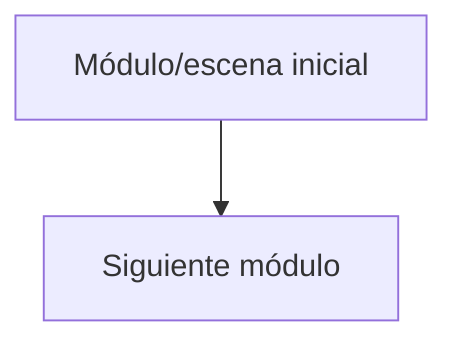

# Arquitectura viva

Diagrama simple, actualizado incrementalmente conforme el proyecto crece.
No lo satures de detalle — solo módulos/capas principales y cómo se conectan.

## Decisiones técnicas relevantes

- [decisión] — [por qué, fecha]
