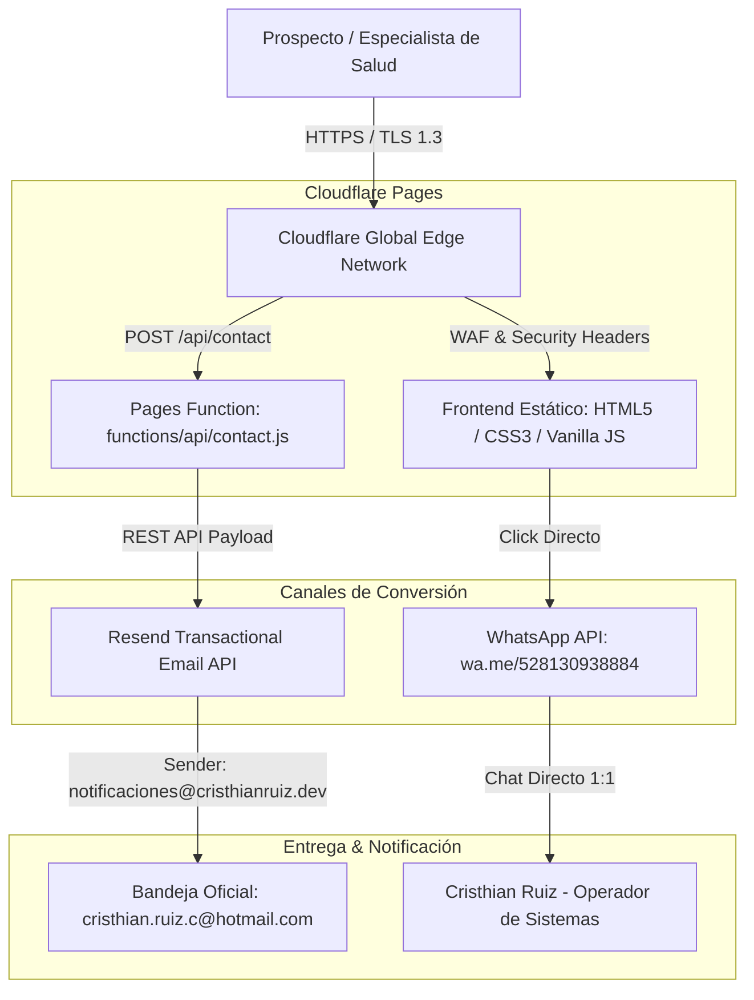

# Arquitectura viva — CrisDev (`cristhianruiz.dev`)

Diagrama estructural del ecosistema en producción (Cloudflare Pages + Serverless Edge Functions + Resend API + WhatsApp Direct).

## Decisiones técnicas relevantes

- **Frontend Estático Puro (HTML5/CSS3/JS ES6+):** Cero overhead de frameworks pesados para garantizar First Contentful Paint < 0.8s en Cloudflare Pages *(31-Ago-2026)*.
- **Serverless Edge Function (`/api/contact`):** Eliminación de servidores Node.js dedicados en vivo para la landing pública, aprovechando Cloudflare Pages Functions sin costo *(31-Ago-2026)*.
- **Resend API con Dominio Propio Verificado:** Envío transaccional desde `notificaciones@cristhianruiz.dev` con `reply_to` automático al prospecto *(31-Ago-2026)*.
- **Seguridad Perimetral (`_headers`):** HSTS a 1 año, protección anti-clickjacking `X-Frame-Options: DENY`, `nosniff` y aislamiento COOP/CORP *(31-Ago-2026)*.
- **SEO Técnico & Schema.org JSON-LD:** Implementación de datos estructurados de tipo `ProfessionalService`, `robots.txt` y `sitemap.xml` para indexación óptima en Google *(31-Ago-2026)*.
