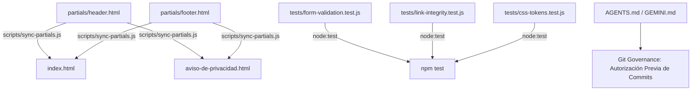

# Plan Técnico — Feature 006: Optimización de Arquitectura, DRY, Testing Automatizado y Git Governance

## 1. Módulos Afectados y Arquitectura

---

## 2. Decisiones Técnicas y Alternativas Descartadas

### Decisión 1: Sincronizador de Partials Estáticos vs. Framework SSG (Astro / Next)
- **Seleccionada:** Script de Node nativo (`scripts/sync-partials.js`) que actualiza los bloques delimitados por `<!-- BEGIN:HEADER --> ... <!-- END:HEADER -->` y `<!-- BEGIN:FOOTER --> ... <!-- END:FOOTER -->` a partir de archivos fuente en `partials/`.
- **Motivo:** Cumple el principio **KISS** y el mandato de la Constitución (`docs/constitution.md`, Sección 3: *Cero dependencias pesadas*). El sitio sigue funcionando directamente abriendo `index.html` con cualquier servidor estático sin requerir compilación obligatoria previa ni alterar la estructura que ya funciona.
- **Alternativa Descartada:** Migrar a Astro o Next.js SSG. Descartada porque añade miles de dependencias en `node_modules`, eleva el tiempo de build innecesariamente para una landing de 2 páginas y viola **YAGNI**.

### Decisión 2: Test Runner Nativo de Node.js (`node:test`) vs. Jest / Vitest
- **Seleccionada:** Utilizar `node:test` y `node:assert` nativos de Node.js (disponibles desde Node 18+).
- **Motivo:** Cero dependencias añadidas a `package.json`. Ejecución ultrarrápida en milisegundos, ideal para validar lógica de sanitización, integridad de anclas y variables CSS.
- **Alternativa Descartada:** Instalar Jest o Vitest. Descartada por peso excesivo para probar funciones de utilidad y consistencia de marcado.

### Decisión 3: Git Governance y Aprobación de Commits
- **Seleccionada:** Incorporar en `AGENTS.md` y `GEMINI.md` la cláusula vinculante de **Aprobación de Commits**:
  - Prohibido ejecutar `git commit` o `git push` automáticamente.
  - El agente debe presentar el estado de los cambios y solicitar la autorización explícita del usuario antes de disparar el commit.

---

## 3. Contratos y Estructura de Archivos

### Nuevos Archivos:
- `partials/header.html`: Fuente única de verdad de la cabecera (Navbar, Logo, Menú, Drawer Móvil).
- `partials/footer.html`: Fuente única de verdad del pie de página (Links, Legal, Redes).
- `scripts/sync-partials.js`: Script de sincronización idempotente.
- `tests/form-validation.test.js`: Pruebas de validación y sanitización anti-XSS.
- `tests/link-integrity.test.js`: Pruebas de integridad de anclas y navegación.
- `tests/css-tokens.test.js`: Pruebas de consistencia de tokens CSS.
