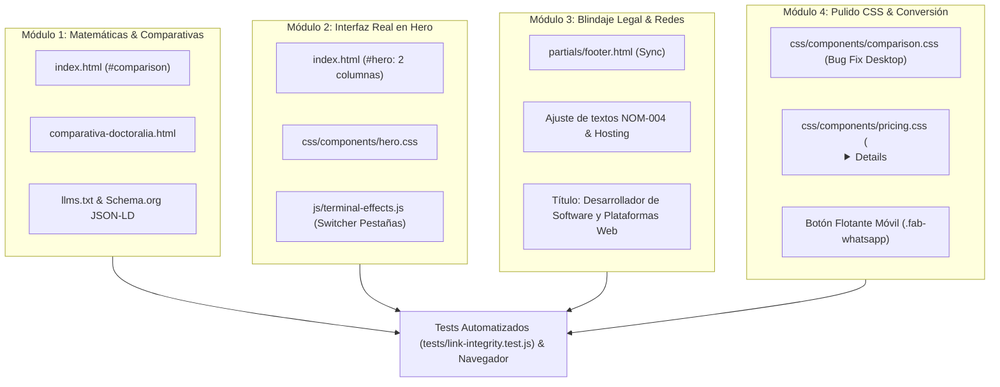

# Plan Técnico — Feature 020: Remediación de Credibilidad Numérica, Prueba Visual en Hero, Blindaje Legal y Pulido de Conversión

**Estado:** 📋 Listo para Ejecución  
**Referencia:** `specs/020-remediacion-credibilidad-prueba-visual-hero-y-pulido/spec.md`

---

## 1. Arquitectura Técnica y Módulos Afectados

---

## 2. Decisiones Técnicas y Alternativas Descartadas

| Decisión Técnica | Alternativa Descartada | Justificación / Motivo |
| :--- | :--- | :--- |
| **Mockup de interfaz en CSS/HTML semántico nativo dentro del Hero** | Usar una imagen estática pesada PNG/WebP generada | Un mockup en HTML/CSS es 100% responsivo, no consume peticiones de imágenes pesadas, permite copiar texto, escala nítido en pantallas retina y se adapta automáticamente al Modo Claro y Modo Oscuro (*Clinical Deep Navy*). |
| **Pestañas interactivas de mockup con JavaScript Vanilla ligero** | Tabs con frameworks o animaciones complejas | Un escuchador de eventos click nativo sobre `.hero-mockup-tab` con cambio de clase activa (`.active`) y `aria-selected` mantiene 0 dependencias y velocidad instantánea. |
| **Corregir bug de tabla con `display: none;` desktop** | Reescribir la tabla a Grid | La tabla HTML existente es semánticamente correcta y funciona perfectamente en móvil; el único defecto era que `.comparison-mobile-label` no estaba oculto en la regla base de escritorio. |
| **Acordeón nativo `
` en tarjetas de precios** | Toggle complejo con JavaScript y alturas calculadas | `
` y `
` son elementos estándar de HTML5 con accesibilidad nativa por teclado, sin requerir librerías ni listeners de JS adicionales. |
| **Botón flotante de WhatsApp condicionado a `@media (max-width: 767px)`** | Mostrarlo también en escritorio | En pantallas grandes la barra de navegación superior y el botón de WhatsApp siempre están visibles y accesibles; colocar un botón flotante en escritorio saturaría la interfaz. |
| **Pruebas de integridad en `tests/link-integrity.test.js`** | Solo verificación manual en navegador | Agregar aserciones para validar la presencia de Instagram y Facebook y ausencia de LinkedIn previene regresiones al sincronizar con `scripts/sync-partials.js`. |

---

## 3. Matriz de Trazabilidad (Spec &rarr; Plan &rarr; Tareas)

| Requisito EARS | Componente / Archivo | Tarea Asociada |
| :--- | :--- | :--- |
| **RF-1.1, RF-1.2, RF-1.3, RF-1.4** | `index.html`, `comparativa-doctoralia.html`, `llms.txt`, JSON-LD | **T1** |
| **RF-3.1, RF-3.2, RF-3.3, RF-3.4, RF-3.5** | `partials/footer.html`, `index.html`, `aviso-de-privacidad.html`, `comparativa-doctoralia.html`, `js/terminal-effects.js` | **T2** |
| **RF-4.1, RF-4.2** | `css/components/comparison.css`, `css/components/pricing.css`, `index.html` | **T3** |
| **RF-2.1, RF-2.2, RF-2.3, RF-2.4, RF-2.5** | `index.html` (`#hero`), `css/components/hero.css`, `js/terminal-effects.js` | **T4** |
| **RF-4.3, RF-4.4** | `index.html`, `css/components/hero.css` (o componente modular), `aviso-de-privacidad.html`, `comparativa-doctoralia.html` | **T5** |
| **Plan de Verificación (Tests, Desktop, Mobile, Consola)** | `tests/link-integrity.test.js`, Servidor local, Navegador | **T6** |
| **Gobernanza Git & Cierre Documental** | `overview/tasks.md`, `overview/session.md` | **T7** |
