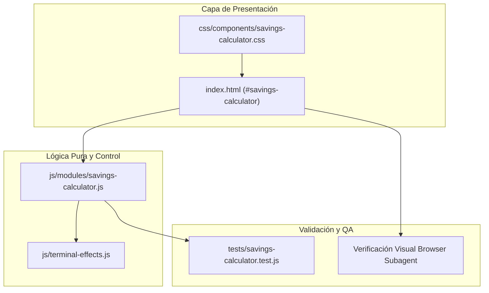

# Plan Técnico — Feature 021: Remediación de Calculadora de Ahorro, ROI Real y Blindaje Comercial

**Estado:** 📋 Listo para Ejecución  
**Referencia:** `specs/021-remediacion-calculadora-ahorro-roi-y-blindaje-comercial/spec.md`

---

## 1. Arquitectura Técnica y Módulos Afectados

---

## 2. Decisiones Técnicas y Alternativas Descartadas

| Decisión Técnica | Alternativa Descartada | Justificación / Motivo |
| :--- | :--- | :--- |
| **Vincular presets a su paquete correspondiente (`data-suggested-package="pkg1|pkg2"`)** | Mantener los presets independientes del paquete seleccionado | Evita que el usuario compare herramientas dispares (como un constructor de landing pages contra un panel médico con base de datos), erradicando de raíz la visualización de números negativos. |
| **Estado Consultivo sobrio (`.card-consultative`) para `netSavings <= 0`** | Ocultar la tarjeta o bloquear el slider para que no baje de $500 | Bloquear el slider o esconder elementos frustra al usuario y parece un bug de la UI. La tarjeta consultiva educa al prospecto, aclara por qué el Paquete 02 cuesta más (suite clínica vs web simple) y ofrece un botón de un clic para ver el ahorro del Paquete 01. |
| **Formateo de moneda con soporte explícito de números negativos (`-$X,XXX MXN`)** | Dejar que el string estándar inserte el menos entre el símbolo y los números (`$-...`) | En español y en estándares financieros internacionales, el signo negativo antecede al símbolo monetario (`-$1,480 MXN`). |
| **Cálculo de amortización escalonado considerando año 1 ($0/mes hosting) y año 2 en adelante** | Fórmula lineal fija `Math.ceil(initialCost / expense)` | Para Paquete 02, el costo en el año 1 es únicamente $5,900. Si `expense >= 492`, el software se paga solo durante los primeros meses del año 1. Si `netSavings <= 0`, no se debe arrojar ningún mes de amortización falso. |
| **Banner de valor contextual dependiente del paquete activo** | Mantener un texto estático único sobre recordatorios de WhatsApp | El Paquete 01 no incluye recordatorios de WhatsApp; mostrar ese mensaje a quien evalúa una web simple causa confusión sobre qué incluye el paquete. Adaptar el texto a captación de pacientes da coherencia 1:1. |

---

## 3. Matriz de Trazabilidad (Spec &rarr; Plan &rarr; Tareas)

| Requisito EARS | Componente / Archivo | Tarea Asociada |
| :--- | :--- | :--- |
| **RF-1.1, RF-1.2, RF-1.3, RF-1.4, RF-1.5, RF-1.6** | `js/modules/savings-calculator.js` | **T1:** Refactorización matemática, amortización real y formato de moneda |
| **RF-2.1, RF-2.2, RF-2.3, RF-2.4, RF-2.5** | `index.html`, `js/modules/savings-calculator.js` | **T2:** Asociación inteligente de presets del mercado a paquetes CrisDev |
| **RF-3.1, RF-3.2, RF-3.3** | `css/components/savings-calculator.css`, `index.html`, `js/modules/savings-calculator.js` | **T3:** Estado consultivo `.card-consultative`, botón de WhatsApp dinámico y CTA alternativo |
| **RF-4.1, RF-4.2** | `index.html`, `js/modules/savings-calculator.js` | **T4:** Banner dinámico de retorno (captación web vs mitigación ausentismo) |
| **RF-5.1** | `tests/savings-calculator.test.js` | **T5:** Suite exhaustiva de pruebas unitarias automatizadas |
| **RF-5.2** | Servidor local (puerto 3000) | **T6:** Validación visual en navegador (desktop y móvil) y cierre documental |
