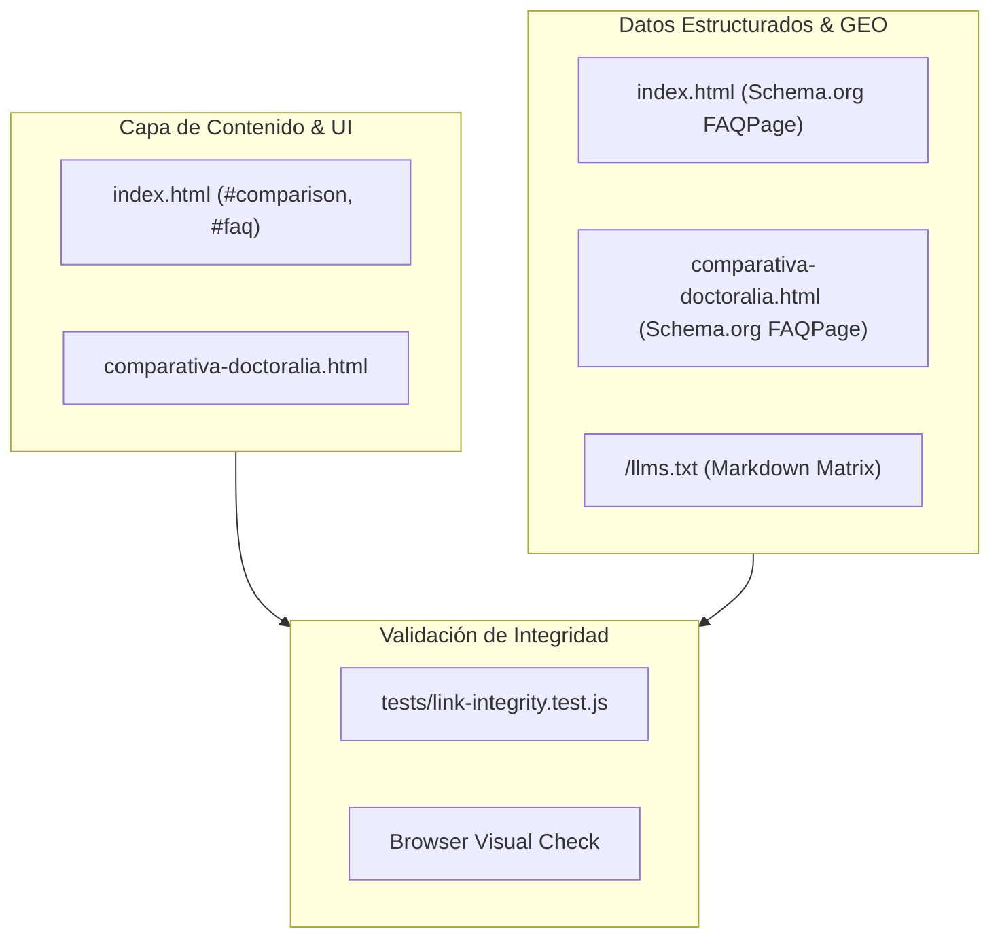

# Plan Técnico — Feature 022: Clarificación de Propiedad de Activos y Software Clínico Gestionado

**Estado:** 📋 Listo para Ejecución  
**Referencia:** `specs/022-clarificacion-propiedad-activos-y-software-gestionado/spec.md`

---

## 1. Arquitectura Técnica y Módulos Afectados

---

## 2. Decisiones Técnicas y Alternativas Descartadas

| Decisión Técnica | Alternativa Descartada | Justificación / Motivo |
| :--- | :--- | :--- |
| **"Soberanía de datos y web propia + Software gestionado"** | Redactar en negativo: *"El panel clínico no te pertenece"* | La redacción negativa genera rechazo comercial inmediato y parece una cláusula abusiva. Presentar la soberanía de datos (pacientes y web 100% tuyos) combinada con el software gestionado (nosotros absorbemos el dolor de cabeza de servidores y seguridad) es el estándar de oro en SaaS clínico B2B. |
| **Pregunta dedicada en `#faq` de `index.html`** | Dejar la aclaración oculta en términos y condiciones o en el pie de página | Los prospectos leen el FAQ para resolver sus objeciones de fondo. Tener la pregunta explícita disipa suspicacias de antemano y le da un argumento de venta irrefutable a Cristhian en WhatsApp. |
| **Actualizar `/llms.txt` y Schema.org JSON-LD simultáneamente** | Modificar únicamente el HTML visual | Los agentes de IA (ChatGPT, Claude, Perplexity) y los rastreadores de Google leen `/llms.txt` y `FAQPage`. Sincronizar estos canales asegura que los modelos de lenguaje expliquen el modelo de CrisDev con exactitud técnica. |
| **Test de regresión automatizado de cadenas de texto** | Confiar únicamente en revisión manual | Una prueba automatizada en `tests/link-integrity.test.js` que verifique la ausencia de frases ambiguas previene que futuros cambios de copy reintroduzcan la confusión. |

---

## 3. Matriz de Trazabilidad (Spec &rarr; Plan &rarr; Tareas)

| Requisito EARS | Componente / Archivo | Tarea Asociada |
| :--- | :--- | :--- |
| **RF-1.1** | `index.html` (#comparison) | **T1:** Actualización de copy en tabla comparativa de `index.html` |
| **RF-1.2** | `comparativa-doctoralia.html` | **T2:** Actualización de copy en matriz comparativa de Doctoralia |
| **RF-1.3** | `/llms.txt` | **T3:** Sincronización de `/llms.txt` |
| **RF-2.1, RF-2.2** | `index.html` (#faq, Schema.org) | **T4:** Pregunta dedicada en FAQ y Schema.org JSON-LD de `index.html` |
| **RF-2.3** | `comparativa-doctoralia.html` (FAQ, Schema.org) | **T5:** FAQ y Schema.org en `comparativa-doctoralia.html` |
| **RF-3.1, RF-3.2** | `tests/link-integrity.test.js` | **T6:** Pruebas automatizadas de integridad y validación visual |
