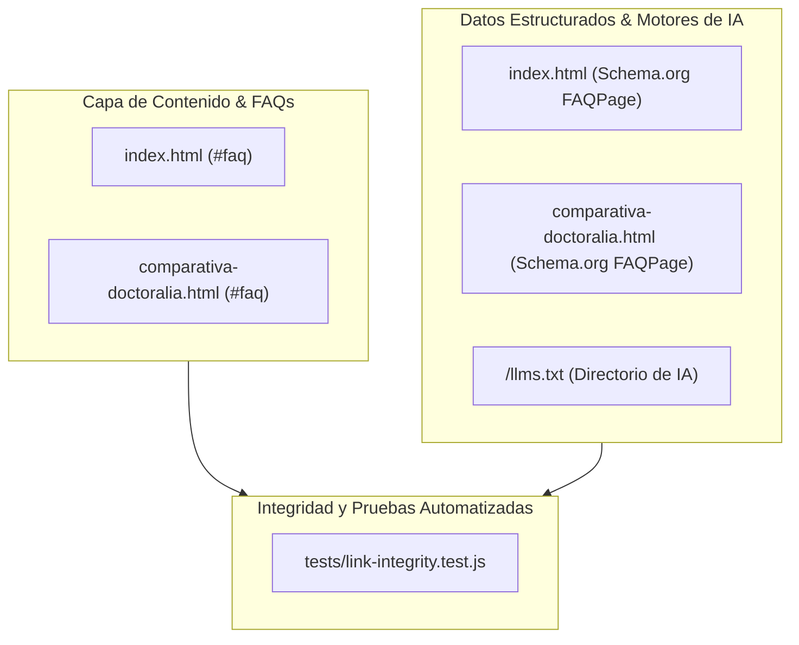

# Plan Técnico — Feature 023: Objeciones de Confianza Operativa (Respaldos, Exportación de Datos y Continuidad en la Nube)

**Estado:** 📋 Listo para Ejecución  
**Referencia:** `specs/023-facturacion-cfdi-respaldos-y-continuidad-operativa/spec.md`

---

## 1. Arquitectura Técnica y Módulos Afectados

---

## 2. Decisiones Técnicas y Alternativas Descartadas

| Decisión Técnica | Alternativa Descartada | Justificación / Motivo |
| :--- | :--- | :--- |
| **Exclusión de CFDI de la web pública** | Publicar que se factura con CFDI sin tener timbrado automático listo | En México, prometer CFDI en la web genera el compromiso de emitirla al recibir el anticipo. Excluirla de la web pública protege la credibilidad de Cristhian y permite gestionarlo privadamente por WhatsApp mediante comprobante formal de servicios. |
| **Política de respaldos periódicos y entrega en formato estándar (CSV / hoja de cálculo)** | Prometer descarga en un clic de "JSON, CSV y PDF" o inventar SLAs del "99.9%" | Apego estricto a los guardarraíles: no prometer formatos de exportación que no estén implementados como botón directo en el panel ni inventar porcentajes de SLA no contratados. La entrega del padrón en formato estándar protege la soberanía de los datos con total realismo. |
| **Desacoplamiento técnico: Cloudflare (web pública) vs. Servidores dedicados (panel clínico)** | Decir que toda la plataforma corre en Cloudflare | Si se atribuye el panel clínico a Cloudflare (asociado a $0/mes en el Paquete 01), choca con el cobro de $499/mes del Paquete 02. La distinción real explica que la web estática corre en Cloudflare ($0/mes) y el software clínico corre en servidores en la nube dedicados con base de datos privada (justificando los $499/mes). |
| **Sincronización simultánea en Schema.org `FAQPage` y `/llms.txt`** | Actualizar únicamente el texto visible en el HTML | Los rastreadores de Google y los agentes de IA (ChatGPT, Claude, Perplexity) consumen las entidades de `FAQPage` y `llms.txt`. Reflejar estas respuestas en los metadatos posiciona a CrisDev con precisión técnica. |

---

## 3. Matriz de Trazabilidad (Spec &rarr; Plan &rarr; Tareas)

| Requisito EARS | Componente / Archivo | Tarea Asociada |
| :--- | :--- | :--- |
| **RF-1.1** | `index.html` (#faq) | **T1:** Integración de la pregunta sobre Respaldos y Exportación en formato estándar en `index.html` |
| **RF-1.2** | `index.html` (#faq) | **T2:** Integración de la pregunta sobre Continuidad en la nube y Soporte 1 a 1 en `index.html` con distinción técnica de servidores |
| **RF-1.3** | `index.html`, `comparativa-doctoralia.html` | **T3:** Purga de cualquier mención de CFDI público en HTML, Schema.org y `/llms.txt` |
| **RF-2.1** | `comparativa-doctoralia.html` (#faq, Schema.org) | **T4:** Sincronización de FAQ de respaldos en `comparativa-doctoralia.html` |
| **RF-2.2** | `index.html` (Schema.org), `/llms.txt` | **T5:** Sincronización en Schema.org JSON-LD `FAQPage` y `/llms.txt` |
| **RF-3.1, RF-3.2** | `tests/link-integrity.test.js` | **T6:** Pruebas automatizadas de integridad y validación |
