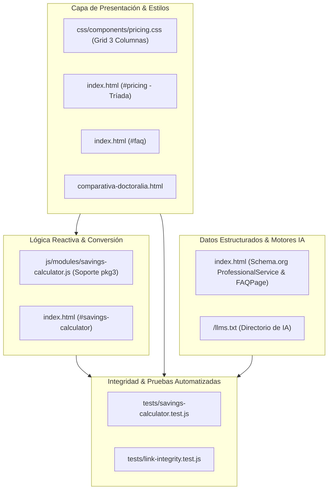

# Plan Técnico — Feature 024: Paquete 03 - Plataforma Clínica Independiente (Solo Software/Agenda) y Tríada Comercial

**Estado:** 📋 Listo para Ejecución  
**Referencia:** `specs/024-paquete-03-plataforma-clinica-independiente/spec.md`

---

## 1. Arquitectura Técnica y Módulos Afectados

---

## 2. Decisiones Técnicas y Alternativas Descartadas

| Decisión Técnica | Alternativa Descartada | Justificación / Motivo |
| :--- | :--- | :--- |
| **Tríada de 3 columnas en `#pricing` con Paquete 02 destacado** | Colocar el Paquete 03 al final como anexo o tarjeta secundaria | La estructura clásica de 3 niveles (*Good, Better, Best* / Componente A, Componente B, Bundle Completo) sitúa los componentes individuales primero y el paquete todo incluido como anclaje visual superior. Esto orienta la decisión de compra sin abrumar. |
| **Salvaguarda CSS `minmax(0, 1fr)` en el nuevo grid de 3 columnas** | Usar `grid-template-columns: 1fr 1fr 1fr` | Según la regla fija de [AGENTS.md](file:///home/cris/Documentos/Proyectos/Pagina%20web%20CrisDev%20-%20clientes/AGENTS.md), el uso de `1fr` plano provoca desbordamiento horizontal en pantallas medianas o celulares cuando los contenedores contienen texto monospace o métricas. `minmax(0, 1fr)` previene forzar el ancho `min-content`. |
| **Cálculo de Inversión a 3 Años para Paquete 03 a $19,864 MXN ($1,900 setup + $499 × 36 meses)** | Ocultar la cuota mensual en la calculadora o proyectar un pago único falso | Enfoque de honestidad radical y credibilidad numérica: se proyecta el costo real acumulado mensual. Aún con el costo mensual real, genera un ahorro contundente de **+$15,776 MXN** frente a Encuadrado y de **+$28,736 MXN** frente a Doctoralia Starter. |
| **Estado Consultivo ante cuotas <= $499/mes** | Mostrar amortizaciones negativas o números verdes falsos | Si el terapeuta paga $400/mes (ej. Wix), comparar una suite clínica de $499/mes contra un constructor web plano no debe mostrar ganancias ficticias. Activa el estado consultivo (`.card-consultative`) invitando a alternar al Paquete 01 (Solo Web). |
| **Exclusividad de Backoffice Privado (`/panel`) sin portal de agendamiento público de pacientes** | Diseñar un portal público abierto para reserva de citas | En la práctica psicoterapéutica, los profesionales realizan un filtrado clínico previo por WhatsApp o llamada para confirmar si su enfoque es adecuado antes de agendar. El panel privado resuelve exactamente el dolor de gestión sin introducir fricciones no deseadas. |

---

## 3. Matriz de Trazabilidad (Spec &rarr; Plan &rarr; Tareas)

| Requisito EARS | Componente / Archivo | Tarea Asociada |
| :--- | :--- | :--- |
| **RF-1.1, RF-1.4** | `css/components/pricing.css` | **T1:** Diseño y estilos del Grid de 3 columnas para la Tríada Comercial en `pricing.css` |
| **RF-1.1, RF-1.2, RF-1.3** | `index.html` (#pricing) | **T2:** Integración de la tarjeta comercial del Paquete 03 en `#pricing` de `index.html` |
| **RF-2.1, RF-2.2, RF-2.3, RF-2.4, RF-2.5** | `index.html`, `js/modules/savings-calculator.js` | **T3:** Extensión reactiva de la Calculadora de Ahorro y ROI para dar soporte al Paquete 03 |
| **RF-3.1** | `index.html` (#faq) | **T4:** Pregunta Frecuente sobre contratación exclusiva de la plataforma clínica en `#faq` |
| **RF-3.2, RF-3.3, RF-3.4** | `comparativa-doctoralia.html`, `index.html`, `/llms.txt` | **T5:** Sincronización en `comparativa-doctoralia.html`, Schema.org JSON-LD y `/llms.txt` |
| **RF-4.1, RF-4.2, RF-4.3** | `tests/savings-calculator.test.js`, `tests/link-integrity.test.js` | **T6:** Ampliación de la suite de pruebas unitarias e integridad en Node.js |
| **Criterios de Aceptación 1-5** | Viewport navegador, consola JS, bitácora SDD | **T7:** Verificación visual en navegador (Desktop/Móvil), validación de consola y cierre documental |
